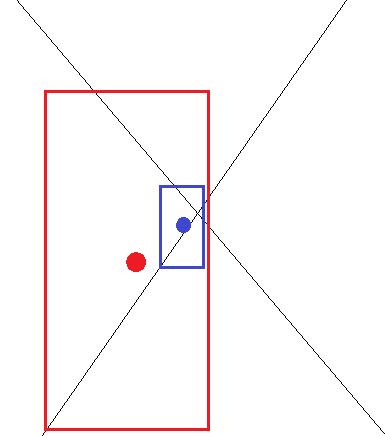
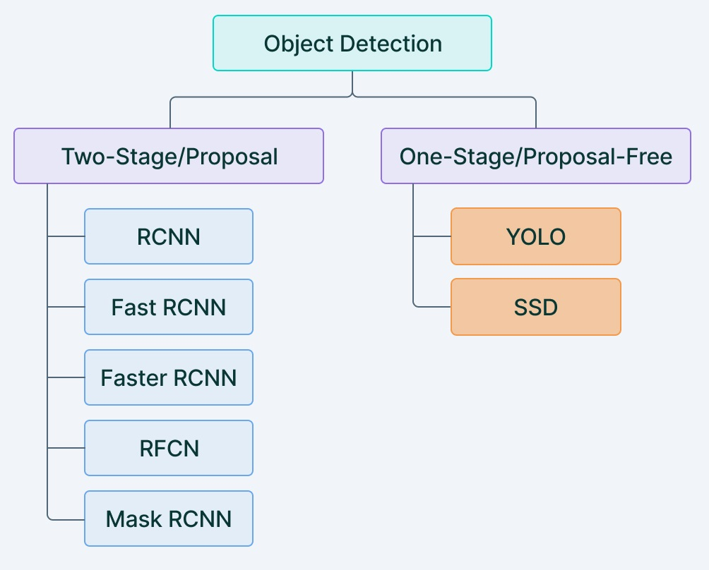
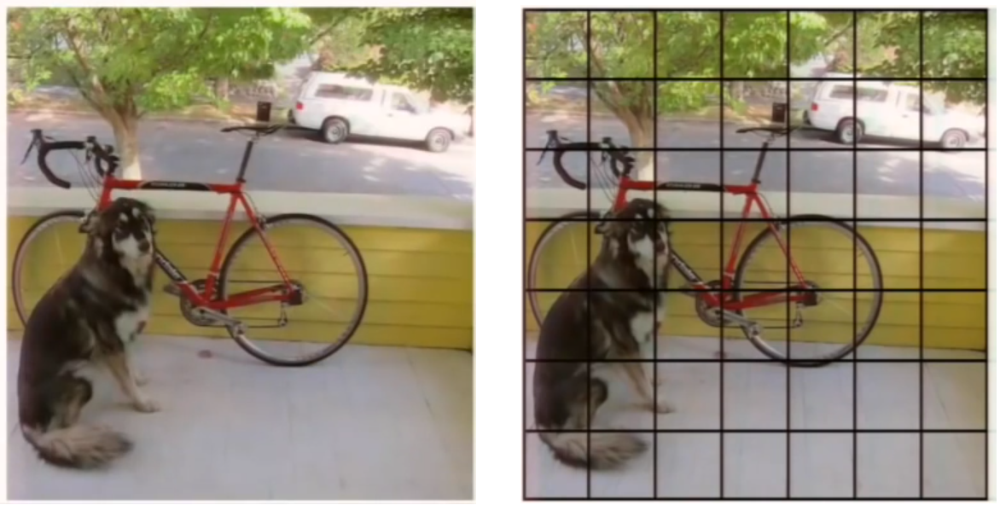
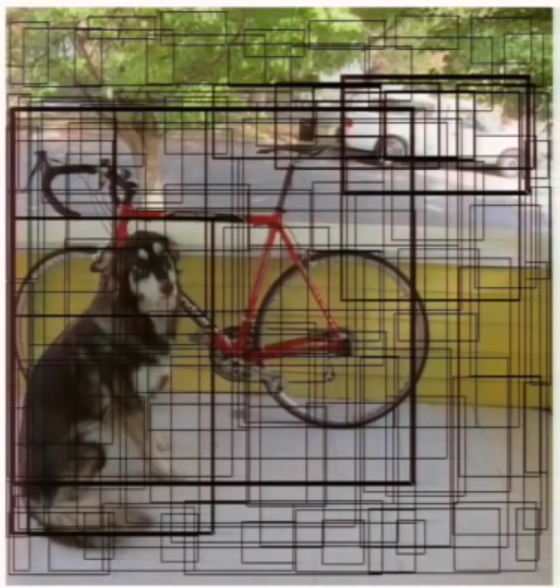
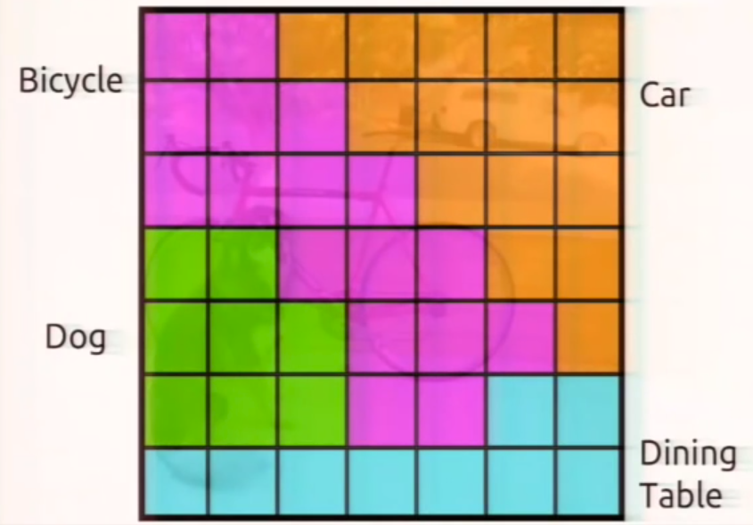
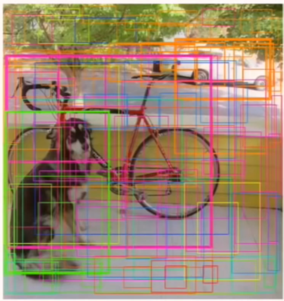
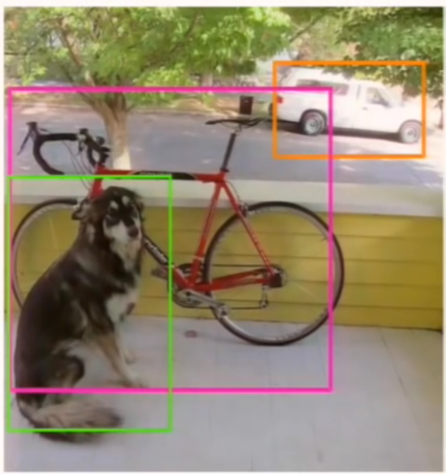
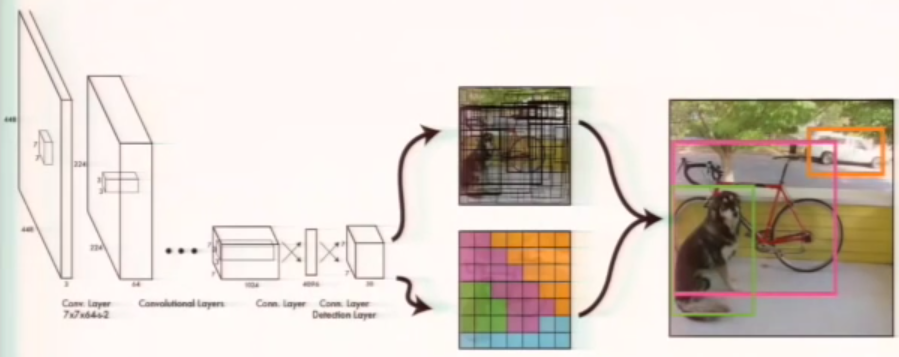

# **Real-Time Social Distancing Detector and People Counter** 👥
A `PyTorch` and `OpenCV` approach to real-time social distancing detection and people counter using `YOLOv5`.

## 📖 **About**
This project came up as a possible application to the reality we are currently experiencing. Covid-19 has forced us to take restrictive measures to stop contagion. One of these measures is the distance that people should keep from each other. Using deep learning techniques applied to computer vision, it is possible to automate the control of people maintaining the right distance between themselves. For this purpose, I exploited the implementation of the `YOLOv5` model to create a real-time social distancing detector. In addition, I also put the option to count how many people appear in the video (frame by frame).

All work is available in the notebook [**yolov5 - part 2 - Real-time social distancing detector and people counter**](https://github.com/PaulinoMoskwa/Real-Time-Social-Distancing/blob/master/yolov5%20-%20part%202%20-%20Real-Time%20Social%20Distancing%20Detector%20and%20People%20Counter.ipynb). 
In addition, to familiarize and become friends with the `YOLOv5` model, I created a notebook, [**yolov5 - part 1 - Getting started**](https://github.com/PaulinoMoskwa/Real-Time-Social-Distancing/blob/master/yolov5%20-%20part%201%20-%20Getting%20Started.ipynb), to serve as an introduction to the topic.

## 📝 **Assumptions and results**

### **1. The video**
First of all, let us look at the video we are dealing with.

We see that the geometry is not too problematic, we can (and in fact we will proceed in this way) leave out the three-dimensionality of the scene at first. We will only work on the distance between the centers of the boxes and not let the depth of the scene affect it. What does this mean in concrete terms? Consider two points, A and B, at a certain distance at the bottom of the frame. Let us take these two points and move them up in the frame (keeping their distance fixed), obtaining points C (A translated) and D (B translated). We will assume that A and B are exactly as close as C and D in reality. This is a strong assumption (we should consider the perspective of the image).

### **2. `YOLOv5`**
Let us first see what the `YOLOv5` model manages to capture in this scene.

It is a very good model and it captures so much. The problem is we are not interested in some of the things it captures (e.g. the handbag, the skateboard, etc). Thus we will be interested in removing those elements and focusing only on the people.

### **3. Minimum distance calculation**
First, we need to determine what will be the minimal distance to be respected.

To do this, we need to make an initial pass of the video and figure out what is the average height of the boxes. We will need this to figure out how to set the distance for which people are too close or far enough.

The first pass of the video (considering the detections made by the `YOLOv5` model) shows the following results:

The result above allows us to complete the assumptions we want to make to calculate the minimum distance to be respected between two box centers:
* we consider that a person is, on average, 1 meter and 70 cm tall
* we consider that a good distance is, about, 1 meter and 30 cm
* an (approximate) average of the heights of the boxes is 65

Obviously this is all approximate since we do not know the position of the camera relative to the ground. Knowing this information, we would get a more accurate job and most importantly we wouldn't need a first pass to estimate the height of the boxes. 

Based on these assumptions, we exploit the following relationship to calculate the minimum distance that two centers should respect: 

$\qquad\qquad average\hspace{2pt}human\hspace{2pt}height\hspace{2pt}:\hspace{2pt}minimal\hspace{2pt}distance\hspace{2pt}in\hspace{2pt}reality\hspace{2pt}=\hspace{2pt} average\hspace{2pt}box\hspace{2pt}height\hspace{2pt}:\hspace{2pt}minimal\hspace{2pt}distance\hspace{2pt}between\hspace{2pt}points$

So that, we can calculate the  $minimal\hspace{2pt}distance\hspace{2pt}between\hspace{2pt}points$  as:

$\qquad\qquad minimal\hspace{2pt}distance\hspace{2pt}between\hspace{2pt}points = average\hspace{2pt}box\hspace{2pt}height\hspace{2pt}\cdot\hspace{2pt}\frac{minimal\hspace{2pt}distance\hspace{2pt}in\hspace{2pt}reality}{average\hspace{2pt}human\hspace{2pt}height}$

### **4. Final outcome**
Now that we have calculated the minimum distance that two centers should maintain, we can color the boxes according to whether this distance is met or not. Two close boxes will be colored red if too close, green if far enough apart. The results of this work can be observed below: 

## ✋ **Limitations and future work**
The work has limitations that are the subject of future work.

### **1. Speed**
Despite the fact that the considered model of `YOLOv5` is one of the lightest (it is the small version, smaller than this there is only the nano version), we are still in a situation where prediction is not instantaneous. This leads to a slight delay between the real-time video and the video with the predictions. This is unfortunately not something that will be easy or simple to get improvements on.

### **2. 3D Geometry**
In this case it worked out relatively well for us. However, it would be more correct to consider the whole scene, and thus include the three-dimensionality of the frame (the depth). To work on this, however, it is necessary to know the position of the camera in the three-dimensional environment and also to know how it was constructed (therefore whether it distorts the scene it captures, etc). However, it is also possible to do some work without knowing all the scene information (camera position and camera characteristics), but simply working on the boxes. In this case it is of my curiosity to see if it is possible to see if the heights and widths (and positions in the frame) of the boxes can help reconstruct the three-dimensionality.

Why is the three-dimensionality of the scene important? Suppose we apply the same reasoning made with this work to an environment where perspective is more extreme. Consider the following space:

In this case the red and blue figures are far apart (as the blue one is far in depth compared to the red one), but the two centers result close if depth is not considered. However, if we reason about the huge difference in the size of the two boxes then we might get results while having no depth information. On the other hand, however, if we put everything on just the relative size of the boxes we might have problems with children (in that, if even close to adults, they have smaller boxes) and with seated people (again, the boxes would be smaller).

### **3. People who are too far from the camera**
Another limitation, this time unfortunately of the `YOLOv5` model, is the excessive distance between the camera and the subjects. If we consider, for example, a shot of a New York Square camera, `YOLOv5` struggles to recognize all the people. In fact, it does not recognize many of them (about a dozen, only those particularly separated from the others). 

--------------------------------------

## 🔬 **About `YOLOv5`**

### **Two-stage vs. one-stage object detection**
There are several possible approaches to deal with the object detection problem. There are two main classes of algorithms: two-stage and one-stage object detection. What is different between one and the other? In the case of two-stage object detection algorithms we are dealing with two operations (and therefore two different algorithms):
1. detecting possible object regions
2. classifing the detected regions

Popular two-step algorithms are R-CNN, Fast R-CNN or Faster R-CNN. In particular, the latter uses a Region Proposal Network (RPN) that proposes regions of interest that might contain objects. The output of the RPN is then fed to a classifier that classifies the region. I investigated the methods of R-CNN, Fast R-CNN and Faster R-CNN in a previous repository, available [here](https://github.com/PaulinoMoskwa/Wildfire-Smoke-Detection).

While this gives accurate results in object detection, with a high Mean Average Precision (mAP), it results in multiple iterations taking place in the same image, slowing down the detection speed of the algorithm and preventing real-time detection.

Instead, one-stage object detection just does the work all at once. The most popular algorithm of this type is YOLO. 

Compared to the approach taken by object detection algorithms before YOLO, which repurpose classifiers to perform detection, YOLO proposes the use of an end-to-end neural network that makes predictions of bounding boxes and class probabilities all at once. Following a fundamentally different approach to object detection, YOLO achieves state-of-the-art results beating other real-time object detection algorithms by a large margin. 

While algorithms like Faster R-CNN work by detecting possible regions of interest using the Region Proposal Network and then perform recognition on those regions separately, YOLO performs all of its predictions in one step. Methods that use Region Proposal Networks thus end up performing multiple iterations for the same image, while YOLO gets away with a single iteration.  

### **How does YOLO work?**
First of all, YOLO puts a grid on top of the image and each cell in this grid is going to be responsible for predicting a few different things.

Each cell is going to predict a certain amount of bounding boxes and a confidence value for every bounding box. The confidence value is nothing but the probability that a box contains and object. Obviously, some cells have no objects and therefore the goal is for them to create boxes with very low conficence value. Displaying all the predictions together gives:

Now we know basically where the objects are in the image, but we do not know what these objects are. So the next thing for each cell to do is to predict a class probability.

Every cell predicts a class probability, which actually is a conditional probability. What does it mean? An orange cell is not saying *"there is a car"*, it is saying *"IF THERE IS AN OBJECT, the object is a car"*. If we consider these conditional probabilities and we multiply them by the confidence values obtained previously, we get the following:

These are the bounding boxes weighted by their probabilities for containing that object. We get a huge amount of boxes: a lot of them are very low confidence values for every class. So we simply threshold the predictions and we perform non-max suppression to get rid of some dupicate detections. What we obtain is:

Therefore the whole architecture is the following:

In one pass we go from the image to the detection. This means we are predicting all of the detections simultaneously, so the model implicitly incorporates the global context in the detection process (it learns things like which objects tend to occur together, relative size and locations of objects, etc).

The pictures and explanation are taken from the outstanding [video](https://github.com/PaulinoMoskwa/Real-Time-Social-Distancing/blob/master/Miscellaneous/You%20Only%20Look%20Once%20-%20Unified%2C%20Real-Time%20Object%20Detection.mp4) (download to watch), that fully explains the mechanism of YOLO.

### **YOLO v+**
Despite its amazing performance, YOLO has limitations. For this reason, new versions of YOLO have been introduced over the years.

* **YOLO v2** 
`YOLOv2` was proposed to fix YOLO's main issues: the detection of small objects in groups and the localization accuracy. `YOLOv2` increases the mean Average Precision of the network by introducing batch normalization. A much more impactful addition to the YOLO algorithm, as proposed by `YOLOv2`, was the addition of anchor boxes. The vanilla version of YOLO predicts a single object per grid cell. While this makes the built model simpler, it creates issues when a single cell has more than one object, as YOLO can only assign a single class to the cell. `YOLOv2` gets rid of this limitation by allowing the prediction of multiple bounding boxes from a single cell. This is achieved by making the network predict 5 bounding boxes for each cell. The number 5 is empirically derived as having a good trade-off between model complexity and prediction performance. 

* **YOLO v3** 
While `YOLOv2` is a super fast network, various alternatives that offer better accuracies have also entered the scene. To improve YOLO with modern CNNs that make use of residual networks and skip connections, `YOLOv3` was proposed.

* **YOLO v4** 
`YOLOv4` proposes the addition of Weighted Residual Connections, Cross Mini Batch Normalization, Cross Stage Partial Connections, Self Adversarial Training, and Mish Activation as methodological changes amongst modern methods of regularization and data augmentation. The authors also make available a `YOLOv4` Tiny version that provides faster object detection and a higher FPS while making a compromise in the prediction accuracy.

* **YOLO v5** 
`YOLOv5` is an open-source project that consists of a family of object detection models and detection methods based on the YOLO model pre-trained on the COCO dataset. It is maintained by Ultralytics and represents the organization's open-source research into the future of Computer Vision works.

## 👀 **Fun facts about `OpenCV` coordinate system**
One thing we need to know, especially when printing a custom version of boxes on frames, is how the image coordinate system of the `OpenCV` library is oriented. The following are my findings.

